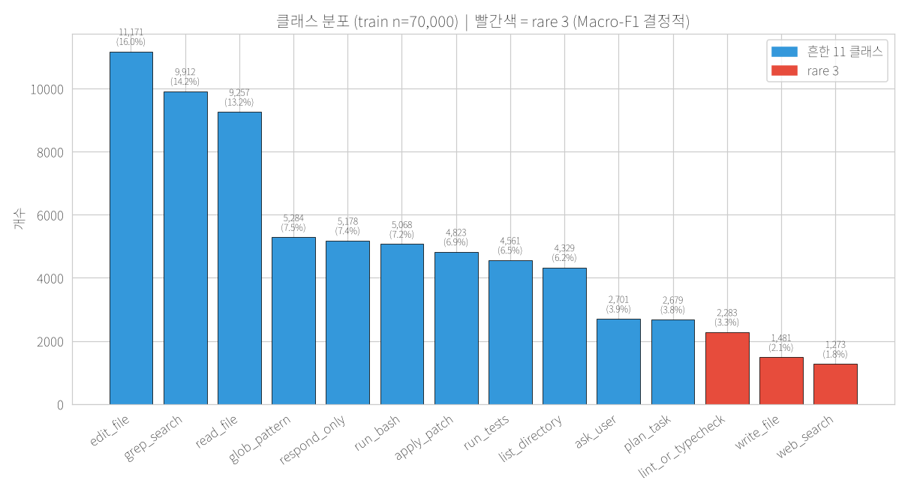
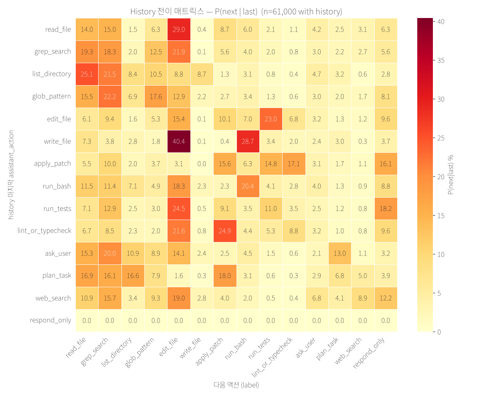

# AI Agent 행동 의사결정 예측

2026 AI SW중심대학 디지털 경진대회 AI부문 [AI Agent 행동(Action) 의사결정 예측 챌린지](https://dacon.io/competitions/official/236694/overview/description)의 실험과 구현 기록입니다.

사용자 요청, 대화 이력과 세션 메타데이터를 입력받아 에이전트의 다음 행동을 **14개 클래스** 중 하나로 예측합니다. 평가지표는 **Macro-F1**입니다.
김건우는 팀 리더로 문제 정의, 데이터 분석, 모델 학습, 검증, 추론 최적화와 제출까지 전 과정을 주도했습니다.

## 접근

- **세션을 분리한 검증:** 같은 세션의 여러 단계가 학습과 검증에 함께 들어가지 않도록 세션 ID를 그룹으로 사용하는 분할을 구성했습니다.
- **입력 구성 비교:** 동일한 데이터 분할과 학습 조건에서 기본 입력, 행동 단서 추가, 입력 순서 변경을 비교했습니다.
- **오프라인 추론:** 텍스트 분류 모델의 조건부 앙상블, int8 가중치 로딩과 어휘 축소를 구현했습니다. 대회 제출 제약은 T4 16GB, 추론 10분과 패키지 1GB였습니다.

## 공개 실험 결과

입력 구성 A/B 실험의 검증 결과입니다. 세 방식 모두 평가 샘플은 **14,001개**입니다.

| 입력 구성 | Macro-F1 |
|---|---:|
| 기본 입력 (`base`) | 0.7562 |
| 행동 단서 추가 (`cue`) | 0.7542 |
| 입력 순서 변경 (`reorder`) | 0.7565 |

이 표는 로컬 검증 실험이며 최종 리더보드 성적을 뜻하지 않습니다. 입력 순서 변경의 차이는 0.0003이며, 단일 비교로 유의한 개선이라고 주장하지 않습니다.

- [실험 코드](experiments/exp_serialize_ab/run_ab.py)
- [전체 결과 JSON](experiments/exp_serialize_ab/results_all.json)
- [입력 직렬화 구현](src/serialize_variants.py)
- [세션 그룹 분할 구현](src/cv.py)

## 데이터 분석





추가 분석 그림은 [notebooks/figures](notebooks/figures)에 있습니다.

## 코드와 실행 경로

| 목적 | 진입점 |
|---|---|
| 입력 구성 A/B 학습 실험 | [experiments/exp_serialize_ab/run_ab.py](experiments/exp_serialize_ab/run_ab.py) |
| 기본 모델의 OOF 검증 | [src/baseline_oof.py](src/baseline_oof.py) |
| 조건부 앙상블 추론 | [experiments/exp_3way_pkg/script.py](experiments/exp_3way_pkg/script.py) |
| 어휘 축소 | [src/vocab_prune.py](src/vocab_prune.py), [src/prune_apply.py](src/prune_apply.py) |

조건부 앙상블 추론 코드는 실행 파일이 있는 디렉터리를 기준으로 다음 경로를 읽습니다.

```text
experiments/exp_3way_pkg/
├── script.py
├── model/
│   ├── ensemble.json
│   ├── serialize_config.json
│   └── <model_tag>/        # config, tokenizer, 모델 가중치, 선택적 remap.npy
├── data/                  # test.jsonl, test.json, test.csv 또는 test.parquet
└── output/submission.csv  # 실행 시 생성
```

`model/<model_tag>/`에는 `quant.safetensors` 또는 `model.safetensors`가 필요합니다. **이 저장소에는 실행에 필요한 학습 가중치가 포함되어 있지 않습니다.**
추론 코드가 요구하는 모델 설정, 토크나이저, 가중치와 데이터를 준비한 뒤 저장소 루트에서 다음 진입점을 사용할 수 있습니다.

```bash
python experiments/exp_3way_pkg/script.py
```

해당 스크립트는 모델과 토크나이저를 로컬 파일에서 읽습니다. 이 README 작성 과정에서는 전체 학습이나 추론을 다시 실행하지 않았습니다.

## 과제와 제출 문서

- [과제 개요](docs/overview.md)
- [데이터와 14개 행동 정의](docs/data.md)
- [제출 환경과 패키지 구조](docs/submission.md)
- [대회 문서 모음](docs/README.md)
