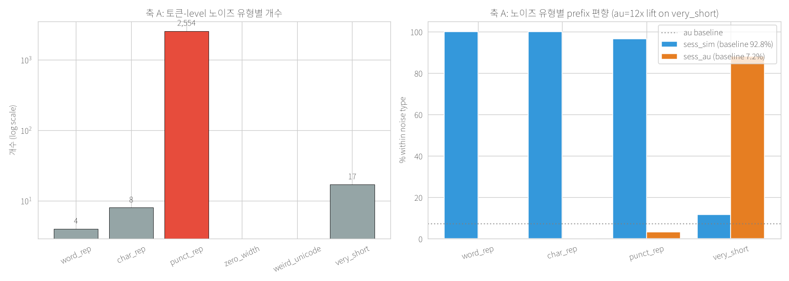
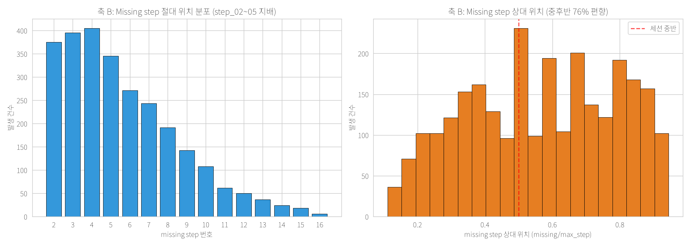
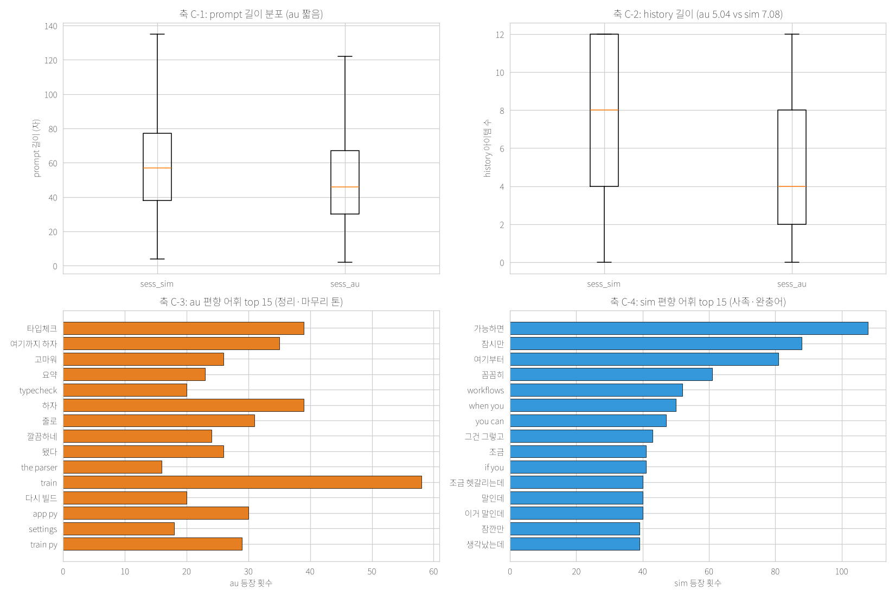

# 데이터 노이즈 감사

**작성**: 2026-07-02
**목적**: 팀·사용자 관찰한 "라벨/데이터 노이즈"를 정면 정량화. `notebooks/01_eda_findings.md`의 발견을 사실/가설 명확 분리하며 심층 조사.
**전제**:
- 팀 이미 20~25% 라벨 노이즈 관찰 (상혁 "학습에 노이즈 많음", 박용욱 "real data 아님")
- 1위 SSU퍼루키 0.78525 → rare 3 완전 실패 상한(77.26%) 초과 → **1위는 rare class F1 확보 중**
- 우리(oh-my-sinsa 4위 0.77585) 이후 개선의 기초는 노이즈 이해

**조사 축**: A(토큰-level artifact) / B(세션 step gap) / C(sess_sim vs sess_au 내용 차이)

**산출**:
- 이 문서 (표·시각화·시사점·팀 공유 요약)
- `data/processed/noise_candidates.csv` (7,073 rows, 6,784 unique ids)
- `notebooks/figures/07~09.png`

---

## 축 A — 토큰-level artifact

### 패턴 & 스캔 결과 (n=70,000)

| 패턴 | 정의 | 감지 | 비중 |
|---|---|---:|---:|
| `word_rep` | 단어 3회 이상 연속 (`MakefileMakefileMakefile`) | 4 | 0.006% |
| `char_rep` | 같은 char 4회 이상 (`YYYY`, `FFFF`, `0000`) | 8 | 0.011% |
| `punct_rep` | `...` 등 3회 이상 반복 punctuation | **2,554** | **3.65%** |
| `zero_width` | zero-width 문자 (U+200B 등) | 0 | 0.0% |
| `weird_unicode` | Private Use Area 문자 | 0 | 0.0% |
| `very_short` | 5자 미만 prompt | 17 | 0.024% |
| very_long (>p99=169자) | 매우 김 | 678 | ~1% |

**유니크 노이즈 후보 sample**: 2,580 (3.69%). 대부분 `punct_rep`.



### 유형별 클래스 편향 (lift = 이 유형 내 비중 / 전체 비중)

**word_rep (n=4)**:
- `grep_search` 50% (3.53× lift), `plan_task` 25% (6.53×), `apply_patch` 25%
- 예시: `sess_sim_20260522_014377-step_03` — "잠시만, 딱 한 군데DockerfileDockerfileDockerfile Dockerfile 쪽은 redact 안 거치고 raw로 찍는 거 같은데 확인하자"

**char_rep (n=8)**: `edit_file` 62.5% (3.92× lift)
- 예시: `sess_sim_20260522_034674-step_08` — "validateInput 초기값이 0xFFFF여야 하는데 0으로 박혀있네. 거기 바로잡아" — `edit_file` 라벨. **자연스러움** (`FFFF`는 코드 hex 값)

**punct_rep (n=2,554)**: `edit_file` 16.8% (lift 1.06×). **클래스 편향 미미** → **정상 대화 스타일** (한국어 `...` 자주 씀). **노이즈 아님**.

**very_short (n=17)**: `run_tests` 41% (6.32× lift), `run_bash` 29% (4.06×), **`lint_or_typecheck` 24% (7.21× lift)** ← rare class 3개 중 하나에서 극단 편향
- 예시: `sess_au_078464_002-step_07` — "다시" (2자) → 재시도 요청. **sess_au 특유 패턴**

### 유형별 prefix 편향

| 유형 | sim % | au % | au lift |
|---|---:|---:|---:|
| word_rep | 100 | 0 | 0.00× |
| char_rep | 100 | 0 | 0.00× |
| punct_rep | 96.7 | 3.3 | 0.46× |
| **very_short** | **11.8** | **88.2** | **12.25×** |

- **`very_short "다시"`는 사실상 sess_au 전용 표현** (12× au 편향)

### 축 A 시사점

1. **진짜 LLM decoding artifact는 매우 소량** (word_rep 4건 + char_rep 8건 = 12건). Rare 케이스로 라벨 신뢰도 약간 흔들 수 있으나 무시할 수준
2. **`punct_rep`은 노이즈 아님** — 자연 한국어 스타일. 필터에서 제외해야
3. **`very_short "다시" 유형은 sess_au 특유 재시도 프로토콜**. rare class(`run_tests`, `lint_or_typecheck`)에 강 편향 → sess_au에서 이런 재시도가 어떤 tool로 이어지는지 sim에는 없는 신호
4. **모델링에는 큰 영향 없음** — 노이즈 필터 우선순위 낮음. 다만 `very_short`는 정성 검토 가치

---

## 축 B — 세션 step gap

### 발견

- **1,679 세션 (17.81%)에 gap 존재** (총 9,429 세션 중)
- 세션 길이 자체는 gap 유무와 무관 (gap 없음 mean 7.38, gap 있음 mean 7.61)
- 단일 gap 1,035 (61%), 다중 gap 644 (39%). 최대 gap size 7

### Missing step 위치

**절대 위치**: step_02~05가 지배 (각각 375~405건). 이후 감소.

**상대 위치** (missing_step / max_step):
| 구간 | 비중 |
|---|---:|
| 0.0~0.2 (초반) | 4.0% |
| 0.2~0.5 (중반) | 32.3% |
| 0.5~0.8 (후반) | **42.6%** |
| 0.8~1.0 (끝 부근) | 21.1% |

→ **중후반 편향 (76%)**



### Gap 앞/뒤 클래스 편향 (lift)

| 위치 | top 클래스 | lift |
|---|---|---:|
| gap 직전 (miss-1) | grep_search 16.6% | 1.17× |
| gap 직전 | read_file 14.5% | 1.10× |
| gap 직후 (miss+1) | edit_file 17.9% | 1.12× |
| gap 직후 | **respond_only 10.2%** | **1.38×** |
| gap 직후 | **apply_patch 9.4%** | **1.37×** |

- **강한 편향은 없음** (최대 1.38×) → **특정 클래스가 gap 만든 게 아님**
- 다만 gap 직후에 `respond_only`/`apply_patch`가 소폭 상승 = 세션 정리·마무리 액션 편향

### Prefix별 gap 비율

- **sess_sim**: 1,558 / 8,330 = **18.70%**
- **sess_au**: 121 / 1,099 = **11.01%**

→ sim이 gap 더 많음. au는 짧은 세션이라 gap 발생 확률 자체 낮음

### 가설 검정

| 가설 | 지지도 |
|---|---|
| **1. 특정 클래스가 라벨링 실패** | ❌ 약함. class lift 최대 1.38× (미미) |
| **2. Test set으로 뺐다 (같은 세션 다른 step 분리)** | ⚠️ 미확정. 5샘플 test만으로는 확인 불가. **DACON 게시판 문의 가치** |
| **3. 원본 세션이 원래 gap 있음** | ⚠️ 약간 지지 (다중 gap 39% 존재) |
| **4. Dedup/curation artifact** | ⚠️ 가능. 다중 gap = 인접 유사 step 제거 흔적 가능 |

### 축 B 시사점

1. **Gap 자체가 모델 성능에 큰 영향 없어 보임** (클래스 편향 미미)
2. **다만 history 이슈 있을 수 있음** — 예: step_04 sample의 `history`가 step_03 assistant_action을 포함하는데, 그 step_03이 label에서 삭제됐다면 history 연속성 확인 필요. **후속 조사 여지**
3. **가장 유력한 원인은 (2) test-set 분리 or (4) dedup**. 팀에 게시판 문의 제안 정도가 액션

---

## 축 C — sess_sim vs sess_au 내용 차이

### 어휘 (log-odds, sim/au 5,000건씩 샘플)

**au 편향 (log-odds > 0) top 15**:
| term | sim freq | au freq | log-odds |
|---|---:|---:|---:|
| 타입체크 | 0 | 39 | +3.91 |
| 여기까지 하자 | 0 | 35 | +3.81 |
| 고마워 | 0 | 26 | +3.52 |
| 요약 | 0 | 23 | +3.40 |
| typecheck | 0 | 20 | +3.27 |
| 하자 | 1 | 39 | +3.22 |
| 깔끔하네 | 1 | 24 | +2.75 |
| 됐다 | 2 | 26 | +2.42 |
| train | 13 | 58 | +1.66 |
| settings | 4 | 18 | +1.56 |

→ **정리·마무리·감사 톤 + 실제 파일명 직접 언급**

**sim 편향 (log-odds < 0) top 15**:
| term | sim freq | au freq | log-odds |
|---|---:|---:|---:|
| 가능하면 | 108 | 0 | -4.47 |
| 잠시만 | 88 | 0 | -4.27 |
| 여기부터 | 81 | 0 | -4.18 |
| 꼼꼼히 | 61 | 0 | -3.90 |
| 그건 그렇고 | 43 | 0 | -3.56 |
| 갑자기 생각났는데 | 39 | 0 | -3.47 |
| 혹시나 해서 | 39 | 0 | -3.47 |
| 막혀서 그런데 | 38 | 0 | -3.44 |
| 하는 김에 | 37 | 0 | -3.41 |
| when you | 50 | 0 | -3.71 |

→ **사족·완충어(softener) 지배. Claude/GPT 대화 스타일**



### 길이·언어

| 지표 | sess_sim | sess_au |
|---|---|---|
| prompt 길이 median | 57자 | 46자 |
| prompt 길이 mean | 61.7 | 51.9 |
| history 길이 mean | 7.08 | **5.04** |
| 언어 mixed % | 56.5 | 55.5 |
| 언어 ko-only % | 15.8 | **20.8** |

### session_meta 필드 편차 (매우 다름)

| 필드 | sess_sim | sess_au | 시사 |
|---|---|---|---|
| user_tier enterprise | 14.7% | **35.0%** | au에 엔터프라이즈 압도적 |
| **git_dirty True** | **78.8%** | 49.8% | sim 항상 작업중, au 절반 clean |
| last_ci_status passed | 38.9% | **55.4%** | au는 안정 상태 편향 |
| top_lang py | 39.4% | 46.3% | au python 편향 |
| top_lang rs (Rust) | 11.8% | 4.1% | sim에 Rust 편향 (시뮬 편중?) |
| turn_index mean | 5.4 | **3.7** | au 초반 편향 |
| elapsed_sec mean | 526.7 | **307.6** | au 세션 짧음 |
| history mean len | 7.08 | **5.04** | au 짧음 |
| budget mean | 91,399 | 105,880 | au 여유 많음 |

### 정성 sample 비교

**sim 대표 문장**:
- "잠깐만 dbt_project에 metrics 포트 하나 더 열어야 돼. 지금 ports 어떻게 돼 있어?"
- "혹시 Redis 쪽으로 가는 게 낫겠네. 그럼 지금 resources에 캐시 관련 설정이 있는지 봐야지..."
- "wanna bump a couple deps for a new feature. show me Cargo.lock if you can"

**au 대표 문장**:
- "고친 거 타입 안 맞는 데 없나 정적분석 돌려"
- "깔끔하네 ㅎㅎ 지금까지 한 거 잘 정리됐고 이제 그만하자"
- "main.tf에 다 몰려있네. 해당 블록 보자"
- "UserAdmin list_display에서 raw email 빼고 마스킹된 걸로 바꿔"

→ **명령형·직접적 톤 vs 사족·softener 톤 격차 뚜렷**

### 축 C 결론 & 가설

**au = 실제 사용자/authentic log 가능성 매우 강함**:
- 톤 특성 (직접적, 마무리 감사, "됐다"/"깔끔하네")
- session_meta 특성 (엔터프라이즈 편향, CI passed 편향, 짧은 세션)
- rare class `lint_or_typecheck` 편향 = au "typecheck" 어휘 편향과 정합

**sim = LLM으로 시뮬레이트된 세션 냄새**:
- 사족·softener 반복 ("가능하면", "잠시만", "혹시나 해서")
- 다양성 억지 삽입 (`ask_user` 4× 편향, `glob_pattern` 4.5× 편향 이미 EDA #01에서 봄)
- Rust language 편향 (시뮬레이터의 template 편중)

**Test set이 어느 성격인가는 여전히 미확정**. Local test.jsonl 5샘플은 모두 `sess_sim_`. 서버 실제 test 30k가 sim인지, au인지, 혼재인지, 다른 origin인지 모름.

### 축 C 시사점 (모델링 관점)

1. **au sample 취급 옵션 3가지**:
   - **(i) 그대로 학습**: 다양성 확보 (단 test가 sim이면 잘못된 방향 학습 가능)
   - **(ii) au downweight**: sample weight ~0.5로 (도메인 시프트 대응)
   - **(iii) au 제외**: 순수 sim에만 학습 (test가 sim이면 최적)
   - → **실험 우선순위**: 상혁 mDeBERTa 재학습 시 세 조건 비교
2. **au의 "typecheck" 어휘가 rare `lint_or_typecheck` 강 신호** → au sample이 rare class 학습에 특히 valuable할 수 있음. 함부로 버리면 안 됨
3. **DACON 게시판 문의 가치**: prefix 의미가 뭔지 공식 확인 시도 (`sess_sim_` vs `sess_au_`이 무엇인지)
4. **상혁 CUE 정규식 확장**: au "typecheck", "다시", "요약", "됐다"는 rare class 강 신호. 상혁 `_explore_cues`에 추가 lexical marker 후보

---

## 종합 시사점

### 우리 팀 순위 향상 lever

Rare class 3개 (`web_search`, `write_file`, `lint_or_typecheck`) F1이 상승해야 77.5% → 78.5% 넘김.

축 A/B/C 조사에서 rare class 관련 발견:
1. **축 A very_short 케이스 17건 중 12건이 rare class 관련** (`run_tests`/`lint_or_typecheck`)
2. **축 C au 어휘 "typecheck", "요약", "됐다" = rare class 신호**
3. **축 B gap은 rare class와 무관** — 무시 가능

### 후속 실험 제안

**단기 (P0-P1, 사용자 담당)**:
1. **au sample downweight vs 제외 실험**: 상혁 코드에 sample_weight 추가해 3가지 조건 val Macro-F1 비교
2. **au 특유 어휘를 상혁 CUE에 추가 실험**: `add_typecheck_cue`, `add_summary_cue` 등 개별 옵션 ablation

**중기 (P2-P3)**:
3. **DACON 게시판에 prefix 의미 문의** (상혁·경모에게 요청)
4. **축 D (baseline self-predict) 노이즈 정량화** — 별도 계획으로

### 노이즈 후보 리스트 활용

`data/processed/noise_candidates.csv` (7,073 rows, 6,784 unique ids):
- axis 분포: B_session_gap 4,490, A_token_anomaly 2,583
- 활용법:
  - 학습 시 `sample_weight` 0.5로 (soft downweight)
  - 별도 학습 시 exclude → val에서 F1 변화 관찰
  - 뷰어에서 id 검색해 정성 재검토

---

## 팀 공유용 요약 (카톡/노션 붙이기)

```
[데이터 노이즈 감사 결과 요약]

축 A — 토큰 반복/이상 문자
- MakefileMakefile 유형: 4건 (미미, 무시 가능)
- FFFF/YYYY 같은 char 반복: 8건 (코드 hex 값, 정상)
- ... (punctuation 반복): 2,554건. 정상 대화 스타일, 노이즈 아님
- 매우 짧은 prompt("다시" 등): 17건 중 88%가 sess_au_. rare class(run_tests, lint_or_typecheck)와 강 편향

축 B — 세션 step gap
- 1,679 세션(17.81%)에 gap 존재
- 중후반(0.5~1.0) 76% 편향
- gap 앞뒤 클래스 편향 미미 (lift ≤ 1.38)
- prefix별: sim 18.70% vs au 11.01% (au는 짧은 세션이라 gap 적음)
- 원인 가설: (a) test set 분리 흔적 or (b) dedup artifact 유력. DACON 게시판 문의 가치

축 C — sess_sim vs sess_au 내용 차이 (핵심 발견)
- au 어휘 편향: "타입체크", "요약", "됐다", "깔끔하네", "고마워", "여기까지 하자"
   → 정리·마무리·감사 톤, 실제 파일명 언급
- sim 어휘 편향: "가능하면", "잠시만", "혹시나 해서", "막혀서 그런데", "when you"
   → 사족·softener·안내 톤 (LLM 대화 스타일)
- session_meta 차이 (매우 극명):
   * enterprise 사용자: sim 14.7% vs au 35.0%
   * git_dirty: sim 78.8% vs au 49.8%
   * CI passed: sim 38.9% vs au 55.4%
   * 세션 길이: sim 526초 vs au 307초 (au 짧음)
- 강한 가설: au = 실제 사용자 로그, sim = LLM 시뮬레이션
   (팀 미발견 정보. 팩트 기반 통계 관찰, 의미는 여전히 추론)

액션 제안
1. au sample downweight vs 제외 vs 그대로 3조건 val 비교
2. 상혁 CUE 정규식에 "typecheck/요약/됐다" 추가 실험 (rare class 신호)
3. DACON 게시판에 prefix 의미 문의 (sess_sim_ vs sess_au_ 뭘 뜻하는지)

산출물
- 노이즈 후보 id 리스트: data/processed/noise_candidates.csv (7,073 rows)
- 시각화 3장: notebooks/figures/07~09.png
- 전체 문서: notebooks/03_data_noise_audit.md
```
